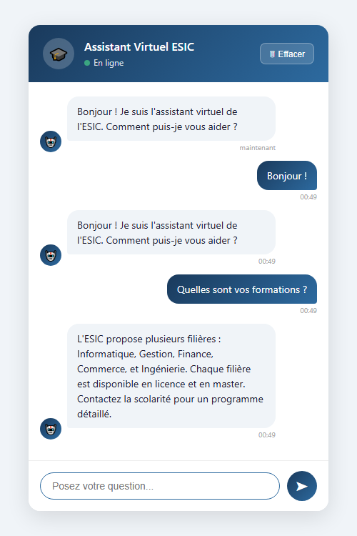

# Assistant Virtuel ESIC

Chatbot intelligent pour l'École Supérieure d'Informatique et de Commerce (ESIC), basé sur un réseau de neurones entraîné sur des questions fréquentes des étudiants.



---

## Fonctionnalités

- Répond aux questions sur l'admission, les filières, les frais, les horaires, les examens, la vie du campus, etc.
- Interface web moderne avec bulles de conversation et indicateur de frappe
- API REST (FastAPI) consommable par n'importe quel frontend
- Documentation interactive automatique via Swagger UI

## Stack technique

| Composant | Technologie |
|---|---|
| Modèle NLP | TensorFlow / Keras (réseau de neurones) |
| Traitement du texte | NLTK + FrenchStemmer |
| API | FastAPI + Uvicorn |
| Interface web | HTML / CSS / JavaScript (vanilla) |

## Structure du projet

```
Assistant_Virtuel_ESIC/
├── Data/
│   └── intents.json          # Base de connaissances (13 intentions, ~120 patterns)
├── static/
│   └── index.html            # Interface web
├── chatbot_core.py           # Module NLP partagé (tokenisation, prédiction, réponse)
├── train_model.py            # Entraînement du modèle
├── api_server.py             # Serveur FastAPI
├── chatbot_interface.py      # Interface en ligne de commande
├── requirements.txt          # Dépendances Python
└── screenshot.png            # Aperçu de l'interface
```

## Installation

```bash
# 1. Cloner le dépôt
git clone https://github.com/ayaelmohdi/Assistant_Virtuel_ESIC.git
cd Assistant_Virtuel_ESIC

# 2. Créer et activer un environnement virtuel
python -m venv chatbot_env
chatbot_env\Scripts\activate        # Windows
# source chatbot_env/bin/activate   # Linux/Mac

# 3. Installer les dépendances
pip install -r requirements.txt

# 4. Entraîner le modèle
python train_model.py
```

## Lancement

### Interface web + API

```bash
uvicorn api_server:app --reload
```

Ouvrir **http://127.0.0.1:8000/** dans le navigateur.

La documentation API est disponible sur **http://127.0.0.1:8000/docs**.

### Interface en ligne de commande

```bash
python chatbot_interface.py
```

## Utilisation de l'API

**Endpoint :** `POST /predict_chatbot/`

```bash
curl -X POST http://127.0.0.1:8000/predict_chatbot/ \
     -H "Content-Type: application/json" \
     -d '{"message": "Quelles sont vos formations ?", "user_id": "etudiant"}'
```

**Réponse :**

```json
{
  "message": "Quelles sont vos formations ?",
  "response": "L'ESIC propose plusieurs filières : Informatique, Gestion, Finance...",
  "intent": "filieres"
}
```

## Intentions supportées

| Tag | Exemples de questions |
|---|---|
| `salutations` | Bonjour, Salut, Hello |
| `admission` | Comment postuler ? Conditions d'admission ? |
| `filieres` | Quelles formations ? Quels cursus ? |
| `frais_scolarite` | Combien coûte la formation ? |
| `horaires` | Quels sont les horaires d'ouverture ? |
| `calendrier_academique` | Quand commencent les cours ? |
| `examens` | Dates des examens ? Résultats ? |
| `contact` | Comment vous contacter ? Adresse ? |
| `stage` | Comment trouver un stage ? |
| `vie_campus` | Y a-t-il une cantine ? Une bibliothèque ? |
| `au_revoir` | Au revoir, Bonne journée |
| `remerciements` | Merci, C'est très utile |
